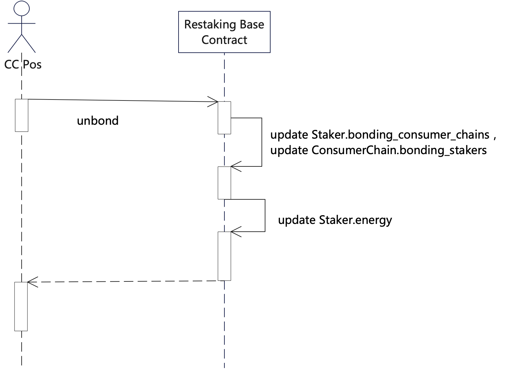
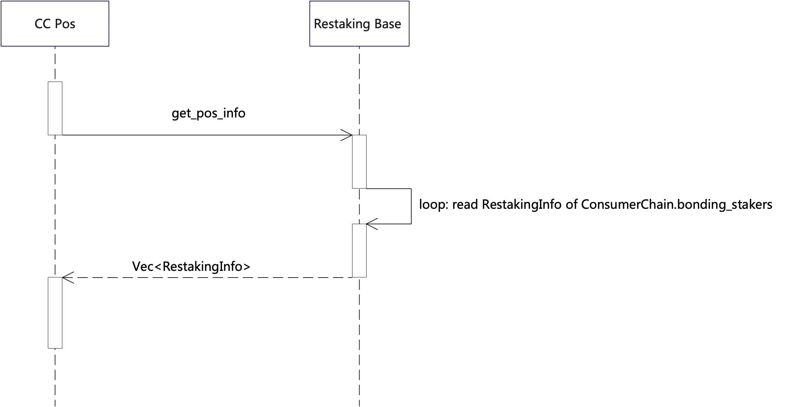

# Restaking Base

This contract aims to provide two main functionalities. The first one is to proxy the user's stake execution, and the second one is to enable the restaking of NEAR tokens that have been staked through this contract. This contract aims to provide two main functionalities. The first one is to proxy the user's stake execution, and the second one is to enable the restaking of NEAR tokens that have been staked through this contract.

Contents:

- [Restaking Base](#restaking-base)
	- [Terminology](#terminology)
	- [Function specification](#function-specification)
		- [Stake](#stake)
		- [Increase Stake](#increase-stake)
		- [Decrease Stake](#decrease-stake)
		- [Register](#register)
		- [Bond](#bond)
		- [Unbond](#unbond)
		- [Kick](#kick)
		- [Slash](#slash)
		- [Unstake](#unstake)
		- [Withdraw](#withdraw)
		- [Query Restaking](#query-restaking)

## Terminology

- `Staker`: A user who performs near-stake operations.
- `Validator`: A near validator.
- `staking pool contract`: A contract deployed on each near `Validator` account, which provides an interface for interacting with the `Validator`.
- `Staking Pool`: An account that implements the `staking pool contract`.
- `stake`: A pos stake on the near network.
- `restake`: Restake the near that has been staked for `Consumer Chain`'s `Pos`.
- `unstake`: A user withdraws their stake. If a restake has been performed, it will first execute the `unbond` operation with all `CC Pos`.
- `withdraw`: A user withdraws assets that can be withdrawn from the `Restaking Base`.
- `Restaking Base`: An account that deploys a contract with the following functions: 1. Can proxy the user's near `stake` to the `Staking Pool`. 2. Can restake the staked near.
- `update-shares`/`ping`: Triggers an update of the user's balance in the `Restaking Base` contract. Anyone can call it, and it will also be triggered when stake/unstake/deposit/withdraw operations occur. This operation will call the `ping` function of the `stake pool contract` to obtain the balance of the `Restaking Base` contract in the `stake pool contract` contract and save it locally.
- `stake shares`: The total number of shares a user has in the `stake pool contract` for a particular `Staking Pool`.
- `staked balance`: The staking amount of `staker`.
- `owner`: The owner account specified by the Staking Pool contract.
- `Staking Reward fee`: The fee charged by the `Restaking Base` contract for the `Staker's` `Staking Reward`. It will be collected by issuing shares to the specified `staking_reward_beneficiary_account`.
- `Consumer Chain`: A Consumer Chain establishes its PoS contract on NEAR to execute its `reward` and `slash` rules and then registers its `unbonding period`, `energy cost`, `CC Gov`, and other parameters with the `Restaking Base` contract.
- `CC Pos`: A Pos contract established by a Consumer Chain on near.
- `CC Gov`: An account specified when registering the `CC Pos`, which has the authority to approve or reject the `slash` submitted by the `CC Pos`.
- `Slash`: A Consumer Chain can apply to penalize the `Staker` during the `bonding` or `unbonding` period, and `CC Gov` decides whether to approve or reject the `Slash`.
- `energy`: `energy` is a concept proposed to suppress the risk of over-leveraging. Each `Staker` has 100 energy points, and each `Consumer Chain` has `energy_cost`. `Staker` will consume `energy` when they `Bond` to `CC Pos`, and recover `energy` when they `Unbond` from `CC Pos`.
- `Bond`: After the `Staker` and `Consumer Chain` bond, the `Staker's` near provides security for the `Consumer Chain`, and the `Consumer Chain` provides `Rewards` to the `Staker`. At the same time, the `Consumer Chain` will have the right to initiate a `slash` against the `Staker`.
- `Unbond`: The `Staker` and `Consumer Chain` break the `Bond`. This process requires an `unbonding period` to complete, during which the `Consumer Chain` can apply to `Slash` the `Staker`.

## Function specification

### Stake

The `stake` operation requires specifying an account that implements the `staking pool` interface. Users will stake attached NEAR tokens to this account and record it internally in the `staking-base` contract.

Users can only choose one `staking pool` for `staking` at a time. If they want to switch to another `staking pool`, they need to complete an `unstake` operation first.

### Increase Stake

Increase the `staker`  balance after the `stake` operation has been completed.

### Decrease Stake

The `Staker` can reduce their `stake` amount, but it cannot be less than the minimum value specified by any `consumer chain` they are currently `bonding` to.

### Register

This interface allows a `consumer chain` to submit registration information to the staking-base contract. The following information needs to be provided: `energy_cost `, `unbond_period `, `minimum_bond_amount `, `website `, `governance `, and `slash_beneficiary_account`. Additionally, a certain amount of NEAR tokens needs to be attached as the registration fee during the registration process.

There will also be another interface `update_consumer_chain_info` that allows the `consumer chain` to update their information (excluding `governance `) and this interface must be called by the `governance` account.

### Bond

After the `staker` has completed the `stake` operation through this contract, they can execute the `bond` operation, which will restake their staked NEAR to a specific `consumer chain` to provide security for the `consumer chain` PoS operation and to receive rewards or `slash` from the `consumer chain`.

And Consumer Chain PoS accepts or rejects a bond request according to its rules, such as \$NEAR > Th, NFT ownership, etc. Restaking energy is here to restrain over-leverage risk. Each staker has a certain amount of energy, and he loses energy after bonding. Energy cost is determined by the consumer chain.

### Unbond

The `staker` can call the `unbond` operation to exit the `Consumer Chain Pos`, which must go through the `unbonding period` specified by the `consumer chain` before completion.

And once unbonded, the staker can’t bond to the consumer chain until the unbonding period expired.

Once `unbond` is finished, the `staker` will recover energy.

### Kick

The `Kick` has the same result as the `Unbond`, but it is called by `Consumer Chain Pos`.

### Slash

`Slash` is a penalty operation that is initiated by the `Consumer Chain Pos` to punish a `staker` for misconduct. The process is divided into two steps: first, the `Consumer Chain Pos`  submits a `slash` to the `staking-base` contract, and then `governance` decides whether to execute the `slash`.

Rules of executing slash:

1. It will slash on the asset in `Staker.pending_unstakes` with the smallest `unlock_time` first.
2. If the assets in `Staker.pending_unstakes` are not sufficient for the `slash` amount, the `unstake` operation is executed first, and `Staker.pending_unstakes` is updated before continuing with the `slash` operation.
3. If the assets are still not enough after the `unstake` operation, it is still considered a successful `slash`, and the total amount successfully `slashed` is returned.
4. After the assets in `Staker.pending_unstakes` are `slashed`, a `PendingUnstake` is created for the `CC Pos`'s `slash_beneficiary_account` that was specified during registration. The `PendingUnstake.unlock_epoch` field inherits the `unlock_epoch` of the `PendingUnstake` that was `slashed`, and `PendingUnstake.unlock_time` is set to 0.

### Unstake

When a `Staker` performs the `unstake` operation, they must first `Unbond` all `consumer chain` PoS they are currently `Bond` to.

The withdrawable time after `Unstake`depends on the longest `Unbonding period` among all bonding `Consumer Chain Pos`.

### Withdraw

The `Staker` can withdraw their `unstaked_balance` in the contract.

### Query Restaking

In order to update validator set, the consumer chain is motivated to query the Restaking Base contract periodically.
